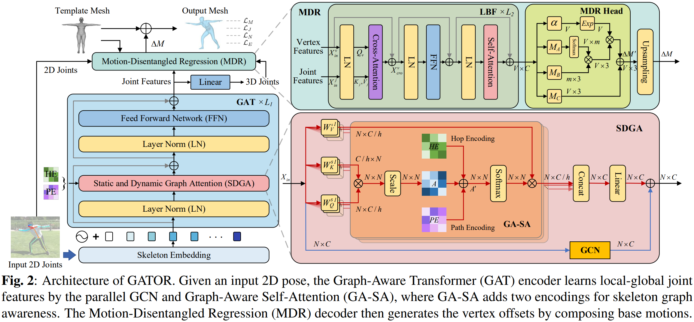

# GATOR: Graph-Aware Transformer with Motion-Disentangled Regression for Human Mesh Reconstruction from a 2D Pose


## Introduction
This repository is the offical implementation of [GATOR: Graph-Aware Transformer with Motion-Disentangled Regression for Human Mesh Reconstruction from a 2D Pose (ICASSP 2023)](https://arxiv.org/pdf/2303.05652.pdf). The overall architecture of GATOR is shown below.


## Install guidelines
- We recommend you to use an [Anaconda](https://www.anaconda.com/) virtual environment. Install [PyTorch](https://pytorch.org/) >= 1.2 according to your GPU driver and Python >= 3.7.2, and run `sh requirements.sh`. 

## Quick demo
- Download the pre-trained GATOR models from [here](#pretrained-model-weights).
- Prepare SMPL layer from [here](#pytorch-smpl-layer).
- Run `python demo/run.py --gpu 0 --input_pose demo/coco_joint_input.npy --joint_set coco`. 
- The `--input_pose {2d_pose_path}` follows the skeleton topology of `--joint_set {coco, human36}`, which can be found in `./data/*/dataset.py`.
- The outputs will be saved in `./demo/result`.

## Results
Here is the performance of GATOR.
For Human3.6M benchmark, GATOR is trained on Human3.6M.
For 3DPW benchmark, GATOR is trained on Human3.6M, COCO, and MuCo.

### Detected 2D pose input

| | MPJPE | PA-MPJPE |
|:---:|:---:|:---:|
| Human36M | 64.0 mm | 44.7 mm |
| 3DPW | 87.5 mm | 56.8 mm |

### Ground truth 2D pose input

| | MPJPE | PA-MPJPE |
|:---:|:---:|:---:|
| Human36M | 48.8 mm | 31.2 mm |
| 3DPW | 50.8 mm | 30.5 mm |

## Directory

### Data

We use the same datasets as [Pose2Mesh](https://github.com/hongsukchoi/Pose2Mesh_RELEASE). Please follow the instructions to perpare datasets and files.

The `data` directory structure should follow the below hierarchy.
```
${ROOT}  
|-- data  
|   |-- base_data
|   |   |-- J_regressor_extra.npy 
|   |   |-- J_regressor_h36m.npy
|   |   |-- smpl_mean_params.npz
|   |   |-- smpl_mean_vertices.npy
|   |   |-- mesh_downsampling.npz
|   |-- Human36M  
|   |   |-- images 
|   |   |-- annotations   
|   |   |-- absnet_output_on_testset.json 
|   |   |-- J_regressor_h36m_correct.npy
|   |-- MuCo  
|   |   |-- data  
|   |   |   |-- augmented_set  
|   |   |   |-- unaugmented_set  
|   |   |   |-- MuCo-3DHP.json
|   |   |   |-- smpl_param.json
|   |-- COCO  
|   |   |-- images  
|   |   |   |-- train2017  
|   |   |   |-- val2017 
|   |   |-- annotations  
|   |   |-- J_regressor_coco.npy
|   |   |-- hrnet_output_on_valset.json
|   |-- PW3D 
|   |   |-- data
|   |   |   |-- 3DPW_latest_test.json
|   |   |   |-- 3DPW_latest_train.json
|   |   |   |-- 3DPW_latest_validation.json
|   |   |   |-- darkpose_3dpw_testset_output.json
|   |   |   |-- darkpose_3dpw_validationset_output.json
|   |   |-- imageFiles
```
- Download base data [[data](https://drive.google.com/drive/folders/1Fwx1IjQ5HrdCypbHwZUB2YCOKsCRvSET)]
- Download Human3.6M parsed data and SMPL parameters [[data](https://drive.google.com/drive/folders/1r0B9I3XxIIW_jsXjYinDpL6NFcxTZart?usp=share_link)][[SMPL parameters from SMPLify-X](https://drive.google.com/drive/folders/12fCumEgs9PXT-dAaOGq0EDpl9dGKKorF?usp=share_link)]
- Download MuCo parsed/composited data and SMPL parameters [[data](https://drive.google.com/drive/folders/1dfhFa1kBHYKLTKuprNc7xixt3yyKEky5?usp=share_link)][[SMPL parameters from SMPLify-X](https://drive.google.com/drive/folders/1Wm1_6tn1u-_RE1iUlibIWfS75O79aJRz?usp=share_link)] 
- Download COCO SMPL parameters [[SMPL parameters from SMPLify](https://drive.google.com/drive/folders/1hJabUWLOMboM2sUhIj0ep6wiRsO3Kh4C?usp=sharing)]  
- Download 3DPW parsed data [[data](https://drive.google.com/drive/folders/1_wi6G6h-JFfb9HGccysJwI02zc_S2DVJ?usp=sharing)]
- All annotation files follow [MS COCO format](https://cocodataset.org/#format-data).
- If you want to add your own dataset, you have to convert it to [MS COCO format](https://cocodataset.org/#format-data).
- Images need to to be downloaded, but if needed you can download them from their offical sites.
- 2D pose detection outputs can be downloaded here: [Human36M](https://drive.google.com/drive/folders/1YjACLyfm7V-cUIXr1b8SWJzmKtuhpOCp?usp=sharing), [COCO](https://drive.google.com/drive/folders/19HyI1ENxF0fKV5xXKqXTRLcc-QJJazMP?usp=sharing), [3DPW](https://drive.google.com/drive/folders/1fgliGqMgQwy6zAoUEZHayq4IySNlyqib?usp=sharing)

### Pytorch SMPL layer

- For the SMPL layer, I used [smplpytorch](https://github.com/gulvarol/smplpytorch). The repo is already included in `${ROOT}/smplpytorch`.
- Download `basicModel_f_lbs_10_207_0_v1.0.0.pkl`, `basicModel_m_lbs_10_207_0_v1.0.0.pkl`, and `basicModel_neutral_lbs_10_207_0_v1.0.0.pkl` from [here](https://smpl.is.tue.mpg.de/downloads) (female & male) and [here](http://smplify.is.tue.mpg.de/) (neutral) to `${ROOT}/smplpytorch/smplpytorch/native/models`.

### Pretrained model weights
Download pretrained model weights from [here](https://drive.google.com/drive/folders/1wHOZ326pystcB5n9ooC_Ln-TjC8Gof2B) to a corresponding directory.
```
${ROOT}  
|-- resules  
|   |-- 3dpw_det.pth.tar
|   |-- 3dpw.pth.tar
|   |-- h36m_det.pth.tar
|   |-- h36m.pth.tar
```

### Train

It is a two-stage training that first pre-trains GAT and then trains the whole GATOR after loading the weights of GAT.

Select the config file in `./asset/yaml/` and train. You can change the train set and pretrained posenet by your own `*.yml` file. 

**1. Pre-train PoseNet**

Use the config file `gat_*.yml` in `./asset/yaml/` to train GAT.

Run
```
python main/train.py --gpu {GPU_id} --cfg ./asset/yaml/gat_{input joint set}_train_{dataset list}.yml
```

**2. Train Pose2Mesh**

Set GAT weights `./experiment/exp_*/checkpoint/best.pth.tar` to the config file `gator_*.yml` in `posenet_path`. And set `posenet_pretrained` True.

Run
```
python main/train.py --gpu {GPU_id} --cfg ./asset/yaml/gator_{input joint set}_train_{dataset list}.yml
```

### Test

Select the config file in `./asset/yaml/` and test.

Run
```
python main/test.py ./asset/yaml/gator_{input joint set}_test_{dataset name}.yml --gpu 0,1,2,3 --cfg

# For example, test 3dpw using detected 2d pose
python ./main/test.py --cfg ./asset/yaml/gator_cocoJ_test_human36_coco_muco_det.yml --gpu 0

```
