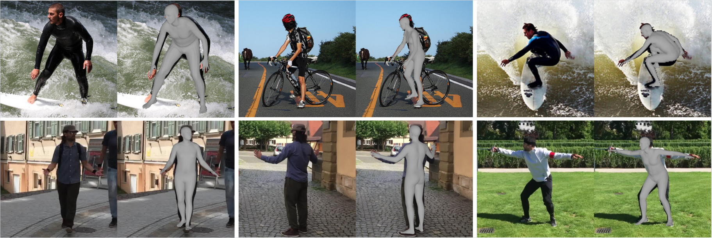
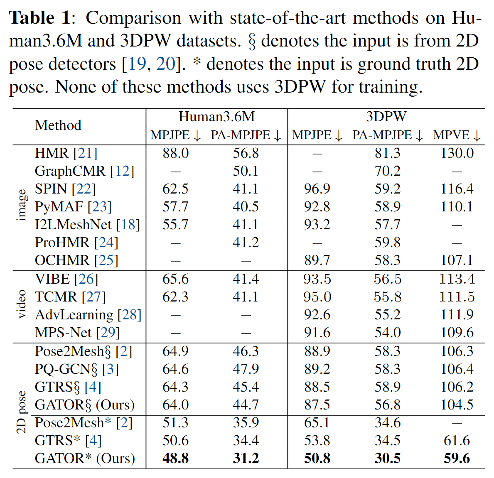

# GATOR: Graph-Aware Transformer with Offset-Disentangled Regression for Human Mesh Reconstruction from a 2D Pose


## Install guidelines
- We recommend you to use an [Anaconda](https://www.anaconda.com/) virtual environment. Install [PyTorch](https://pytorch.org/) >= 1.2 according to your GPU driver and Python >= 3.7.2, and run `sh requirements.sh`. 

## Results
Here is the performance of GATOR.



## Directory

### Data

We use the same datasets as [Pose2Mesh](https://github.com/hongsukchoi/Pose2Mesh_RELEASE). Please follow the instructions to perpare datasets and files.

The `data` directory structure should follow the below hierarchy.
```
${ROOT}  
|-- data  
|   |-- Human36M  
|   |   |-- images  
|   |   |-- annotations   
|   |   |-- J_regressor_h36m_correct.npy
|   |   |-- absnet_output_on_testset.json 
|   |-- MuCo  
|   |   |-- data  
|   |   |   |-- augmented_set  
|   |   |   |-- unaugmented_set  
|   |   |   |-- MuCo-3DHP.json
|   |   |   |-- smpl_param.json
|   |-- COCO  
|   |   |-- images  
|   |   |   |-- train2017  
|   |   |   |-- val2017  
|   |   |-- annotations  
|   |   |-- J_regressor_coco.npy
|   |   |-- hrnet_output_on_valset.json
|   |-- PW3D 
|   |   |-- data
|   |   |   |-- 3DPW_latest_train.json
|   |   |   |-- 3DPW_latest_validation.json
|   |   |   |-- darkpose_3dpw_testset_output.json
|   |   |   |-- darkpose_3dpw_validationset_output.json
|   |   |-- imageFiles
```
- Download Human3.6M parsed data and SMPL parameters [[data](https://drive.google.com/drive/folders/1kgVH-GugrLoc9XyvP6nRoaFpw3TmM5xK)][[SMPL parameters from SMPLify-X](https://drive.google.com/drive/folders/1s-yywb4zF_OOLMmw1rsYh_VZFilgSrrD)]
- Download MuCo parsed/composited data and SMPL parameters [[data](https://drive.google.com/drive/folders/1yL2ey3aWHJnh8f_nhWP--IyC9krAPsQN)][[SMPL parameters from SMPLify-X](https://drive.google.com/drive/folders/1_JrrbHZICDTe1lqi8S6D_Y1ObmrerAoU?usp=sharing)]
- Download COCO SMPL parameters [[SMPL parameters from SMPLify](https://drive.google.com/drive/folders/1X7OMEGQJOe0Tcn2GvvP1koKkq4yghIzr?usp=sharing)]  
- Download 3DPW parsed data [[data](https://drive.google.com/drive/folders/1pT0Ix3FxieEQf0HhEbMN1o-DWRzw2Ugh?usp=sharing)]
- All annotation files follow [MS COCO format](https://cocodataset.org/#format-data).
- If you want to add your own dataset, you have to convert it to [MS COCO format](https://cocodataset.org/#format-data).
- Images need to to be downloaded, but if needed you can download them from their offical sites.
- 2D pose detection outputs can be downloaded here: [Human36M](https://drive.google.com/drive/folders/1iRuNa6CqoHbloJ-wFPpW6g72QmP9xZT-?usp=sharing), [COCO](https://drive.google.com/drive/folders/1x0lLocLWloN813njSTsP0K09opTcLULE?usp=sharing), [3DPW](https://drive.google.com/drive/folders/1qt5R4wMTP1FSUtSi52lUke3EQazNkqVh?usp=sharing)

### Pytorch SMPL layer

- For the SMPL layer, I used [smplpytorch](https://github.com/gulvarol/smplpytorch). The repo is already included in `${ROOT}/smplpytorch`.
- Download `basicModel_f_lbs_10_207_0_v1.0.0.pkl`, `basicModel_m_lbs_10_207_0_v1.0.0.pkl`, and `basicModel_neutral_lbs_10_207_0_v1.0.0.pkl` from [here](https://smpl.is.tue.mpg.de/downloads) (female & male) and [here](http://smplify.is.tue.mpg.de/) (neutral) to `${ROOT}/smplpytorch/smplpytorch/native/models`.

### Pretrained model weights
Download pretrained model weights from [here](https://drive.google.com/drive/folders/1wHOZ326pystcB5n9ooC_Ln-TjC8Gof2B) to a corresponding directory.
```
${ROOT}  
|-- resules  
|   |-- 3dpw_det.pth.tar
|   |-- 3dpw_gt.pth.tar
|   |-- h36m_det.pth.tar
|   |-- h36m_gt.pth.tar
```

### Test

Select the config file in `${ROOT}/asset/yaml/` and test. You can change the pretrained model weight. To save sampled outputs to `obj` files, change `TEST.vis` value to `True` in the config file.

Run
```
python main/test.py ./asset/yaml/gator_{input joint set}_test_{dataset name}.yml --gpu 0,1,2,3 --cfg

# test 3dpw using detected 2d pose
python ./main/test.py --cfg ./asset/yaml/gator_cocoJ_train_human36_coco_muco_det.yml --gpu 0

```
